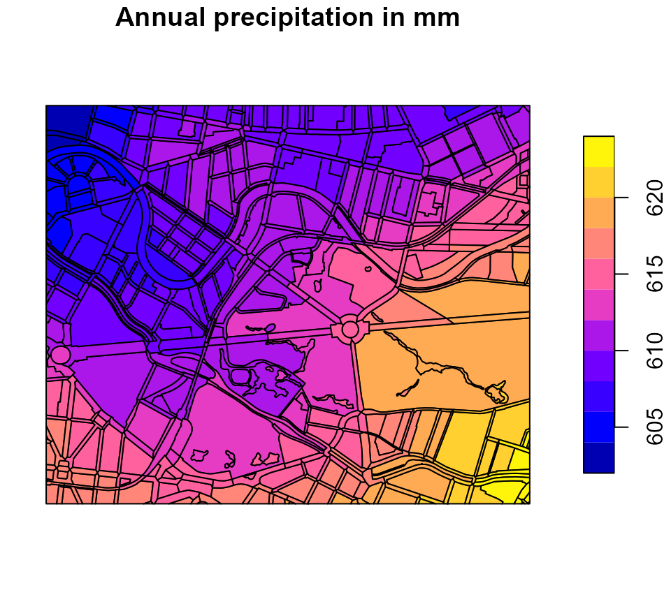
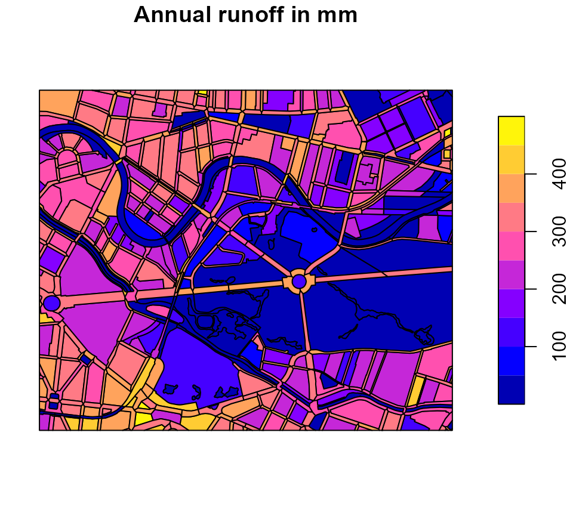
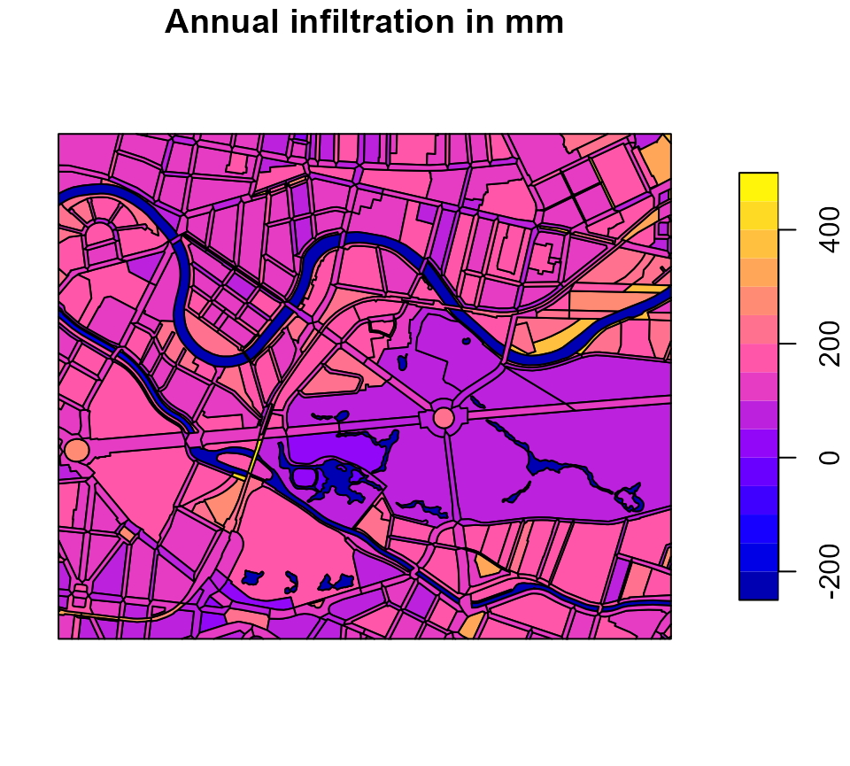
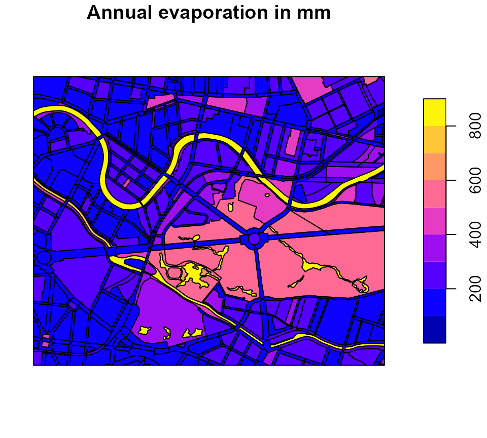
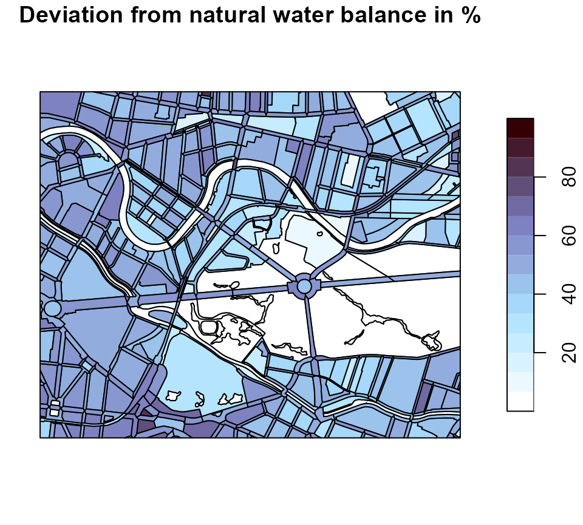
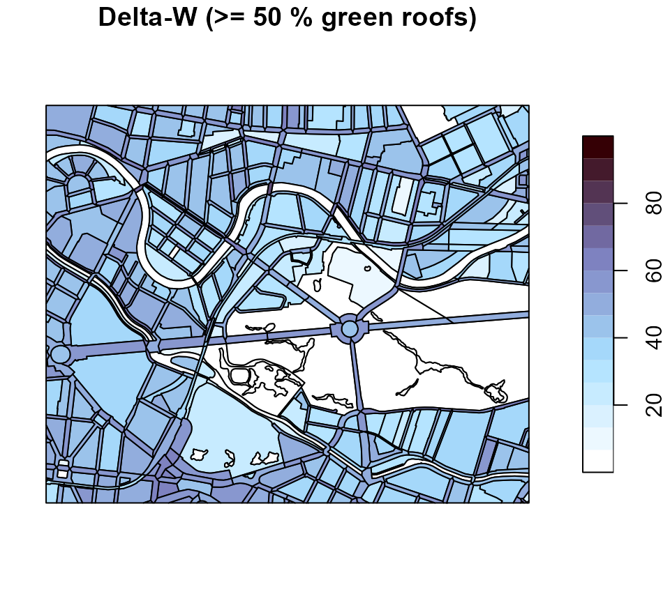
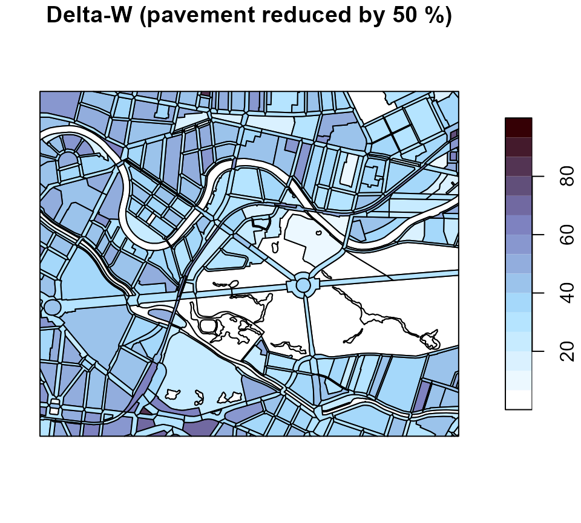
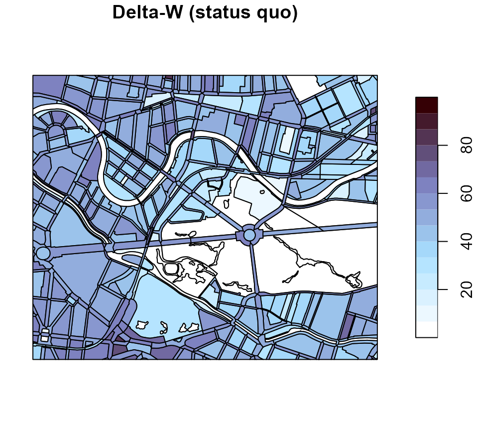

# How to Simulate Water Balance with R-Abimo

## Background

This package provides an R-implementation and extension of the simple
water balance model Berlin ABIMO 3.2, which was originally developed by
the Federal Institute of Hydrology ([Bundesanstalt für
Gewässerkunde](https://www.bafg.de)) for rural areas and later adapted
for urban areas, namely for Berlin, Germany. In May 2022, the source
code of the model was published on the developer platform GitHub
(<https://github.com/umweltatlas/abimo>).

During the research project [AMAREX](https://amarex-projekt.de/en) (an
acronym for the German translation of “adaptation of stormwater
management to extreme events”), funded by the former German Federal
Ministry of Education and Research ([Bundesministerium für Bildung und
Forschung – BMBF](https://www.bmbf.de/EN/Home/home_node.html)), we, the
package authors from [Kompetenzzentrum Wasser Berlin gGmbH
(KWB)](https://kompetenz-wasser.de/de) started to work on the original
program code, written in the programming language C++
([https://github.com/KWB-R/abimo](https://github.com/KWB-R/abimo/)). We
then decided to transfer the model to the [programming language
R](https://www.r-project.org/), to rename it to R-Abimo (see
e.g. [here](https://amarex-projekt.de/en/news/abimo-r-abimo)) and to
publish it in the form of this R package
[kwb.rabimo](https://github.com/KWB-R/kwb.rabimo). Compared to the
original model, R-Abimo is more generic (i.e. can be more easily adapted
to other cities than Berlin) and it contains some additional features:

- simulation of stormwater management measures (green roofs, swales),
- “conversion” of urban areas to “natural” areas,
- calculation of delta-W, an indicator for the deviation between the
  urban (status quo) state and an assumed “natural” state.

## Prerequisites

To use the package, you need to have R installed in a version \>= 4.3.1.
You can download the current version of R from
[here](https://cran.r-project.org/bin/windows/base/).

## Installation

In order to install kwb.rabimo directly from our GitHub account
[KWB-R](https://github.com/kwb-r/), we recommend to install the R
package remotes first:

``` r

# Install package "remotes" from CRAN
install.packages("remotes")
```

You can then install kwb.rabimo in the latest “official” version:

``` r

# Install package "kwb.rabimo" (latest "release") from GitHub
remotes::install_github("KWB-R/kwb.rabimo", build_vignettes = TRUE)
```

By setting `build_vignettes = TRUE` you make sure that this tutorial
vignette is installed together with the package.

## Usage

### Provide input data and configuration for Berlin

Compared to the original C++ version of Abimo we have modified the
structures of input data, output data and configuration. For Berlin,
Germany, we provide data in the new structures in the package:

``` r

# Load Berlin data in the original Abimo format
abimo_inputs <- kwb.rabimo::rabimo_inputs_2025
```

The object `abimo_inputs` is a list with two elements:

- `abimo_inputs$data` is a data frame containing the actual input data.
  Each row represents a block area and each column represents a block
  area’s property.
- `abimo_inputs$config` is a list of parameters that configure the
  calculation of runoff and evapotranspiration, respectively, and the
  infiltration swale model.

Please refer to the help page of `rabimo_inputs_2025` for further
information on the different input columns and model parameters.

To open the help page, run

``` r

?kwb.rabimo::rabimo_inputs_2025
```

In addition to the short descriptions given on the help page you may
refer

- to the [description of the original ABIMO model approaches given by
  Berlin’s Senate Department for Urban Development, Building and Housing
  (in
  German)](https://www.berlin.de/umweltatlas/wasser/wasserhaushalt/2017/methode/)
  or
- to the [original ABIMO user manual (in
  German)](https://www.berlin.de/umweltatlas/_assets/literatur/goedecke_et_al_abimo2019_doku.pdf).

**Note:** We provide also an object `rabimo_inputs_2020`, that refers to
an older version of the Berlin data set. It can be used in almost the
same way as `rabimo_inputs_2025`. However, this old version does not
contain geographical information and we do not cover it within this
tutorial.

### Inspect the input data

You may inspect the first rows (and only the most relevant columns) of
the input data with

``` r

head(as.data.frame(abimo_inputs$data)[, 1:24])
#>               code prec_yr prec_s epot_yr epot_s district total_area      roof
#> 1 0100980011000100     608    324     666    509        1   4623.972 0.3243243
#> 2 0100980011000200     607    324     666    509        1  13430.944 0.0004668
#> 3 0100980011000300     607    324     666    509        1   5603.764 0.3893303
#> 4 0100980021000200     609    324     666    509        1  34344.730 0.4511181
#> 5 0100980021000300     608    324     666    509        1  48930.206 0.4155595
#> 6 0100980021000400     609    324     666    509        1  13977.561 0.0939597
#>   green_roof swg_roof       pvd swg_pvd srf1_pvd srf2_pvd srf3_pvd srf4_pvd
#> 1     0.0000     0.86 0.3704374    0.50     0.49     0.46     0.03     0.02
#> 2     0.0000     0.70 0.4371382    0.68     0.31     0.53     0.07     0.09
#> 3     0.0939     0.76 0.4414658    0.55     0.20     0.60     0.10     0.10
#> 4     0.2134     0.94 0.3339549    0.75     0.45     0.28     0.13     0.14
#> 5     0.0277     0.73 0.3574335    0.61     0.42     0.38     0.08     0.12
#> 6     0.0000     0.82 0.4508725    0.78     0.31     0.56     0.01     0.12
#>   srf5_pvd to_swale gw_dist ufc30 ufc150 land_type veg_class irrigation
#> 1        0        0     5.9    13     10     urban       9.5          0
#> 2        0        0     5.2    11     10     urban       3.6          0
#> 3        0        0     4.5    13     10     urban       1.5          0
#> 4        0        0     5.4    13     10     urban       5.3          0
#> 5        0        0     5.6    12     10     urban      13.2         50
#> 6        0        0     4.5    11     10     urban       2.7          0
```

and you may print the whole configuration object with

``` r

abimo_inputs$config
#> $runoff_factors
#>     roof surface1 surface2 surface3 surface4 surface5 
#>     1.00     0.90     0.70     0.40     0.10     0.48 
#> 
#> $bagrov_values
#>       roof green_roof   surface1   surface2   surface3   surface4   surface5 
#>       0.05       0.65       0.11       0.11       0.25       0.40       0.25 
#> 
#> $swale
#> swale_evaporation_factor 
#>                      0.1
```

### Visualise the input data

Since we provide the Berlin dataset together with geographical
information we can plot the spatial distribution of a variable (e.g. the
annual precipitation) in the form of a map:

``` r

# Provide a subset of the data representing a zoom into the centre of Berlin
berlin_zoom <- kwb.rabimo::crop_box(abimo_inputs$data, 
  xoffset = 0.35, 
  yoffset = 0.5, 
  xscale = 0.07, 
  yscale = 0.07
)
#> Warning: attribute variables are assumed to be spatially constant throughout
#> all geometries

# Plot annual precipitation
plot(berlin_zoom[, "prec_yr"], main = "Annual precipitation in mm")
```



### Run R-Abimo for the status quo (urban state)

To run R-Abimo, call the main function
[`run_rabimo()`](https://kwb-r.github.io/kwb.rabimo/reference/run_rabimo.md)
by passing both the input data and the configuration object to the
function:

``` r

# Run R-Abimo
water_balance_urban <- kwb.rabimo::run_rabimo(
  data = berlin_zoom, 
  config = abimo_inputs$config
)
#> You are using an old configuration. No problem, I convert it.

# Have a look at the first lines of the result data frame
head(sf::st_drop_geometry(water_balance_urban))
#>               code      area  runoff infiltr  evapor
#> 1 0200010761000000 85207.227 378.040 108.615 116.345
#> 2 0200010901000100 14948.442   0.000  97.119 512.881
#> 3 0200010901000200  8911.477 199.563 171.552 240.885
#> 4 0200010901000300 29381.735  21.930 317.488 272.581
#> 5 0200010941000100 22281.140 285.523 123.478 194.999
#> 6 0200010941000200  8264.302 405.532  75.383 128.085
```

The result data frame contains two columns that are copied from the
input data:

- `code` - unique identifier of each block area,
- `area` - the total block area in square metres in column \`area

as well as three columns containing the model outputs, namely the water
balance components:

- `runoff` - surface runoff in mm,
- `infiltr` - infiltration in mm, and
- `evapor` - evaporation in mm.

If the model inputs contained geographical information (as in our case)
that information is restored in the output so that the model results can
be plotted in terms of maps:

``` r

# Plot model output "runoff"
plot(water_balance_urban[, "runoff"], main = "Annual runoff in mm")
```



``` r

# Plot model output "infiltration"
plot(water_balance_urban[, "infiltr"], main = "Annual infiltration in mm")
```



``` r

# Plot model output "evaporation"
plot(water_balance_urban[, "evapor"], main = "Annual evaporation in mm")
```



### Generate your own block areas

The package provides a function
[`generate_rabimo_area()`](https://kwb-r.github.io/kwb.rabimo/reference/generate_rabimo_area.md)
to generate block areas in the input format that R-Abimo requires. You
need to pass at least the unique identifier(s) (`code`) for the block
area(s). If you leave all the other arguments blank, all the block
properties (i.e. columns of the data frame) are filled with default
values. However, you can override the default values by passing
arguments that are named according to the names of the input columns:

``` r

# Generate artificial block areas, using default values and differing only in 
# the fractions of the areas that refer to roofs
codes <- paste0("area-", 1:5)
art_blocks <- kwb.rabimo::generate_rabimo_area(
  code = codes, 
  roof = seq(0, 1, length.out = length(codes))
)

# Have a look at the data
art_blocks
#>     code prec_yr prec_s epot_yr epot_s district total_area main_frac roof
#> 1 area-1     600    300     700    500        0        100         1 0.00
#> 2 area-2     600    300     700    500        0        100         1 0.25
#> 3 area-3     600    300     700    500        0        100         1 0.50
#> 4 area-4     600    300     700    500        0        100         1 0.75
#> 5 area-5     600    300     700    500        0        100         1 1.00
#>   swg_roof pvd swg_pvd srf1_pvd srf2_pvd srf3_pvd srf4_pvd srf5_pvd road_frac
#> 1        1 0.6     0.7      0.5      0.2      0.1      0.1      0.1         0
#> 2        1 0.6     0.7      0.5      0.2      0.1      0.1      0.1         0
#> 3        1 0.6     0.7      0.5      0.2      0.1      0.1      0.1         0
#> 4        1 0.6     0.7      0.5      0.2      0.1      0.1      0.1         0
#> 5        1 0.6     0.7      0.5      0.2      0.1      0.1      0.1         0
#>   pvd_r swg_pvd_r srf1_pvd_r srf2_pvd_r srf3_pvd_r srf4_pvd_r gw_dist ufc30
#> 1   0.9         1        0.9        0.1          0          0       3    13
#> 2   0.9         1        0.9        0.1          0          0       3    13
#> 3   0.9         1        0.9        0.1          0          0       3    13
#> 4   0.9         1        0.9        0.1          0          0       3    13
#> 5   0.9         1        0.9        0.1          0          0       3    13
#>   ufc150 land_type veg_class irrigation
#> 1     13     urban        35          0
#> 2     13     urban        35          0
#> 3     13     urban        35          0
#> 4     13     urban        35          0
#> 5     13     urban        35          0

# Run R-Abimo on the block areas
art_water_balance <- kwb.rabimo::run_rabimo(
  data = art_blocks, 
  config = abimo_inputs$config
)
#> You are using an old configuration. No problem, I convert it.

# How does the roof area influence the runoff?
plot(art_blocks$roof, art_water_balance$runoff)
```


You may use this function to do some sensitivity analysis of the R-Abimo
model.

### Compare the urban state with a natural reference state

In the research project [AMAREX](https://amarex-projekt.de/de) we
propose to use the deviation of the (urban) water balance from its
assumed “natural” state as an indicator for the vulnerability of an
urban area to climate-related effects (such as heat, flooding, negative
impacts on the surface water quality). As a measure of deviation we
introduce \\\Delta W\\ that is calculated as follows:

\\\Delta W =
\frac{1}{2}\space(\|e\_{nat}-e\_{urb}\|+\|i\_{nat}-i\_{urb}\|+\|r\_{nat}-r\_{urb}\|)\space\frac{100\\}{P}\\

with

- \\e\_{nat}\\ and \\e\_{urb}\\ = evaporation for the natural and urban
  state, respectively, in mm,
- \\i\_{nat}\\ and \\i\_{urb}\\ = infiltration for the natural and urban
  state, respectively, in mm,
- \\r\_{nat}\\ and \\r\_{urb}\\ = runoff for the natural and urban
  state, respectively, in mm,
- \\P\\ = annual precipitation in mm.

The higher the value of \\\Delta W\\ the higher the deviation from the
natural water balance, i.e. the area is less similar to a natural area.
The lower the value of \\\Delta W\\ the lower is the deviation from the
natural water balance, i.e. the more similar the urban area is to a
natural area.

Our hypothesis is that a lower value of \\\Delta W\\ indicates a better
preparedness to climate change effects (e.g. because increased
evaporation as it occurs in a natural state scenario leads to a
reduction of heat).

### Run R-Abimo for a natural state scenario

In the package we provide a function
[`data_to_natural()`](https://kwb-r.github.io/kwb.rabimo/reference/data_to_natural.md)
that converts urban block areas to corresponding “natural” block areas.
The function converts all roof areas and unbuilt paved areas to pervious
areas and assumes an overall vegetation as it can be found in a park (a
mixture of meadows, bushes and trees).

Let’s use this function to simulate the water balance for the “natural”
equivalent of our urban area in the Berlin city centre. In all following
calls to
[`run_rabimo()`](https://kwb-r.github.io/kwb.rabimo/reference/run_rabimo.md)
we will set `silent = TRUE` so that console outputs are suppressed.

``` r

# Convert urban state to "natural" state
berlin_zoom_natural <- kwb.rabimo::data_to_natural(berlin_zoom)

# Calculate the water balance for the "natural" state
water_balance_natural <- kwb.rabimo::run_rabimo(
  data = berlin_zoom_natural, 
  config = abimo_inputs$config,
  silent = TRUE
)
#> You are using an old configuration. No problem, I convert it.
```

### Calculate and plot “Delta-W”

Calculate the deviation from the natural state in percent:

``` r

delta_w <- kwb.rabimo::calculate_delta_w(
  urban = water_balance_urban,
  natural = water_balance_natural
)
```

The function `claculate_delta_w` returns a data frame with two columns:

- `code` - the code of the areas,
- `delta_w` - the value of \\\Delta W\\ in percent.

``` r

# Show the first rows of the delta_w data frame (without geometry) 
head(sf::st_drop_geometry(delta_w))
#>               code delta_w
#> 1 0200010761000000    62.7
#> 2 0200010901000100    15.7
#> 3 0200010901000200    39.6
#> 4 0200010901000300    37.7
#> 5 0200010941000100    47.3
#> 6 0200010941000200    66.6
```

If the water balance results were provided together with their
geographical information, the spatial distribution of \\\Delta W\\
values can be visualised in a map.

In order to do so, we first define a helper function for plotting
Delta-W with a nice colour palette:

``` r

# Define function to plot Delta-W
plot_delta_w <- function(data, main) {
  palette <- colorRampPalette(c("white", "#a9e0ff", '#7b7bbc', "#350005"))(15)
  breaks <- seq(0, 100, length.out = length(palette) + 1)
  plot(data[, "delta_w"], main = main, pal = palette, breaks = breaks)
}
```

Now let’s use the function to plot the Delta-W values in a map:

``` r

# Plot deviation from natural water balance
plot_delta_w(delta_w, main = "Deviation from natural water balance in %")
```



### Simulate rainwater management measures

R-Abimo currently allows to simulate three rainwater management
measures:

- green roofs,
- unsealing of paved areas,
- infiltration swales.

These rainwater management measures are shortly demonstrated in the
sections below. In addition to that, the user may also modify the values
in the other columns, if desired, in order to calculate the effect these
variables have on the water balance.

For example,

- the composition of different pavement types is controlled by the
  variables `srf1_pvd`, `srf2_pvd`, `srf3_pvd`, `srf4_pvd`, and
  `srf5_pvd` (their sum represents the total paved area and must be
  equal to 1.0). Each class is assigned a pair of model parameters,
  runoff factor and Bagrov value, respectively, that are defined in the
  configuration object (see above).
- changing the value of `roof`, can be useful to simulate the effect of
  new buildings or demolitions.
- the parameter `veg_class` can be adjusted to test the impact of
  vegetation on the water balance, keeping in mind that a veg_class of
  50 corresponds to a typical urban park with trees, while a value of 75
  corresponds to a forested area.

#### Simulate green roofs

Green roofs increase the evaporation and reduce the runoff. In order to
be able to simulate the effect of green roofs in R-Abimo, we have
introduced a column `green_roof` to the input data. The values given in
this column refer to the fractions of the roof areas that refer to green
roof areas.

Let’s see how the deviation from the natural state decreases if we
introduce more green roofs to our test area in the city centre. We
assume that in each block the fraction of roof areas that belong to
green roofs is at least 50 percent:

``` r

# Make a copy of the original input data
zoom_green_roof <- berlin_zoom

# Target green roof fraction
green_roof_target <- 0.5

# Which blocks need more green roofs?
needs_green_roofs <- zoom_green_roof$green_roof < green_roof_target

# Set the target green roof fraction
zoom_green_roof$green_roof[needs_green_roofs] <- green_roof_target

# Simulate the water balance
water_balance_green_roof <- kwb.rabimo::run_rabimo(
  data = zoom_green_roof, 
  config = abimo_inputs$config,
  silent = TRUE
)
#> You are using an old configuration. No problem, I convert it.

# Calculate Delta-W
delta_w_green_roof <- kwb.rabimo::calculate_delta_w(
  urban = water_balance_green_roof,
  natural = water_balance_natural
)
```

``` r

# Plot Delta-W for the status quo
plot_delta_w(delta_w, main = "Delta-W (status quo)")
```


``` r

# Plot Delta-W for the green roof scenario
plot_delta_w(delta_w_green_roof, main = "Delta-W (>= 50 % green roofs)")
```



The colours become brighter referring to lower Delta-W values i.e.  more
“natural” water balances.

#### Simulate the unsealing of paved areas

The column `pvd` refers to the fractions of the total areas that are
paved. In order to simulate that paved areas are unsealed we decrease
the fractions of paved areas by a constant factor, let’s say we reduce
the fractions by 50 percent:

``` r

# Make a copy of the original input data
zoom_unsealed <- berlin_zoom

# Reduce the fraction of paved areas by 50 percent
zoom_unsealed$pvd <- zoom_unsealed$pvd * 0.5

# Simulate the water balance
water_balance_unsealed <- kwb.rabimo::run_rabimo(
  data = zoom_unsealed, 
  config = abimo_inputs$config,
  silent = TRUE
)
#> You are using an old configuration. No problem, I convert it.

# Calculate Delta-W
delta_w_unsealed <- kwb.rabimo::calculate_delta_w(
  urban = water_balance_unsealed,
  natural = water_balance_natural
)
```

``` r

# Plot Delta-W for the status quo
plot_delta_w(delta_w, main = "Delta-W (status quo)")
```


``` r

# Plot Delta-W for the green roof scenario
plot_delta_w(delta_w_unsealed, main = "Delta-W (pavement reduced by 50 %)")
```



We see an effect similar to that of the green roof scenario: colours
become brighter referring to smaller Delta-W values.

#### Simulate infiltration swales

In order to simulate infiltration swales we introduced a column
`to_swale` to the input data. The values in this column indicate the
fraction of the total sealed area (i.e. roof area + unbuilt paved area)
that is connected to an infiltration swale. The infiltration model is
quite simple: We assume that the infiltration swale works perfectly,
i.e. a small part of the inflow is converted to evaporation and the
remaining part of the inflow is converted to infiltration. The
configuration object contains the `swale_evaporation_factor` that
determines the fraction of the incoming inflow that is converted to
evaporation.

Let’s (probably unrealistically) assume that in each block we could
connect 50 percent of the sealed area to an infiltration swale. How
would that change Delta-W?

``` r

# Make a copy of the original input data
zoom_swale <- berlin_zoom

# Connect 50 percent of the sealed (= roof + unbuilt paved) areas to swales
zoom_swale$to_swale <- 0.5

# Simulate the water balance
water_balance_swale <- kwb.rabimo::run_rabimo(
  data = zoom_swale, 
  config = abimo_inputs$config,
  silent = TRUE
)
#> You are using an old configuration. No problem, I convert it.

# Calculate Delta-W
delta_w_swale <- kwb.rabimo::calculate_delta_w(
  urban = water_balance_swale,
  natural = water_balance_natural
)
```

``` r

# Plot Delta-W for the status quo
plot_delta_w(delta_w, main = "Delta-W (status quo)")
```



``` r

# Plot Delta-W for the green roof scenario
plot_delta_w(delta_w_swale, main = "Delta-W (50% of sealed connected to swale)")
```


We let it as an exercise to the user to assess which of the three
measures has the biggest impact!
